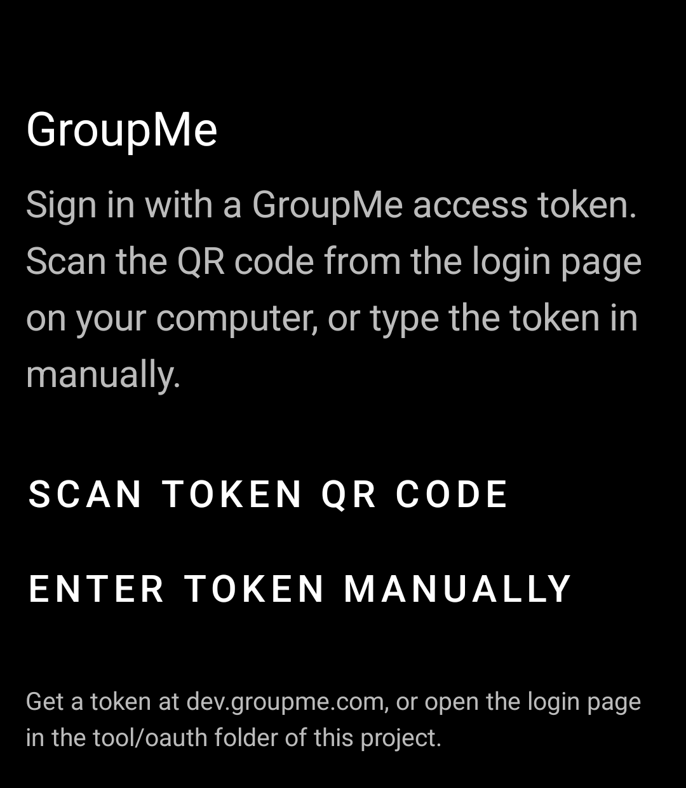
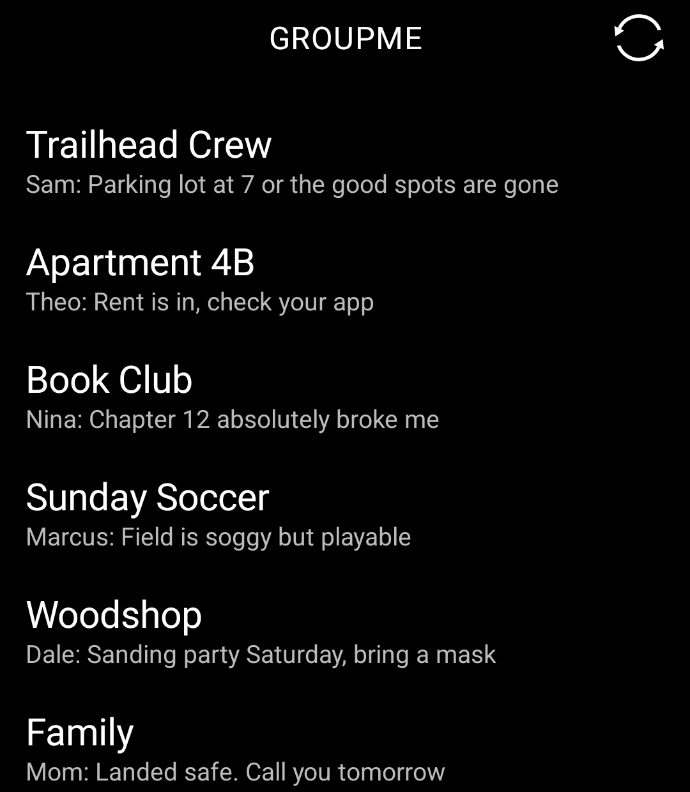
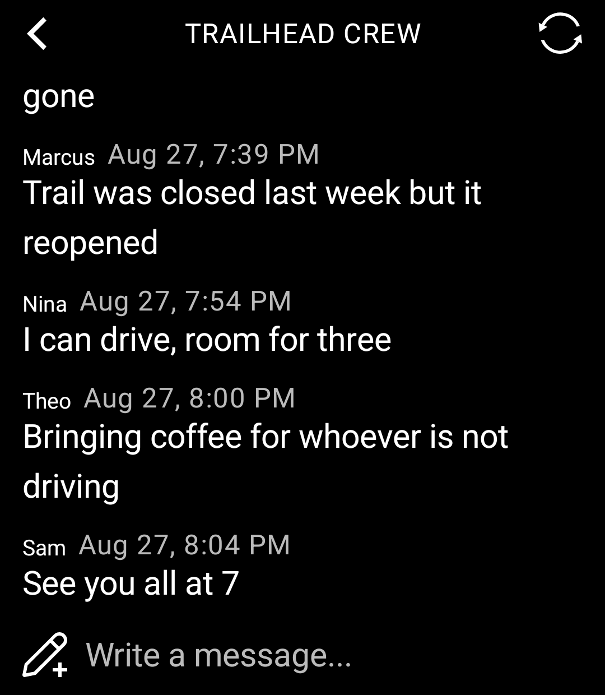
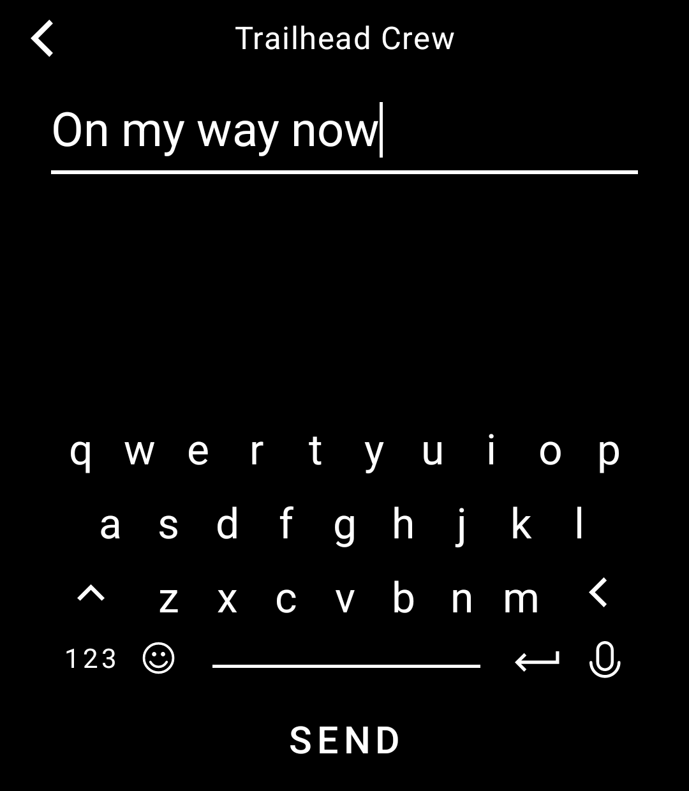

# LightMe

A GroupMe client for the [Light Phone III](https://www.thelightphone.com/), built with Light's
[light-sdk](https://github.com/lightphone/light-sdk).

Read and send GroupMe messages on a phone designed to be used as little as possible. No feeds,
no badges, no infinite scroll — just your groups, in the LightOS black-and-white interface.

> This repository is a fork of `lightphone/light-sdk`. All of the LightMe code lives in
> [`tool/`](tool/); everything else is Light's SDK, kept in sync with upstream. Light's original
> README is preserved as [SDK_README.md](SDK_README.md).

## Screenshots

<p align="left">
  
  
  
  
</p>

*Screenshots are from the LightOS emulator. The names and messages shown are made up — no real
conversations here.*

## Features

- **Your groups**, sorted by most recent activity, each with a one-line preview
- **Read conversations** with sender names and timestamps, paging back through history
- **Send messages** using the native Light Phone keyboard
- **Live updates** — new messages arrive over a WebSocket connection while the tool is open,
  no manual refresh required
- **Photo attachments** render inline; tap one for a full-screen view
- **Sign in by QR code** from a computer, or type an access token in by hand

## Your account stays yours

There are no credentials in this repository, and none are baked into the app. Each person signs
in with their own GroupMe access token, which is:

- entered on the device (scanned or typed), never compiled in
- checked against `GET /users/me` before it is accepted
- stored in the tool's private DataStore, which no other app on the phone can read
- sent only to `api.groupme.com` and `push.groupme.com`, never anywhere else

Logging out erases it from the device.

## Getting an access token

1. Sign in at [dev.groupme.com](https://dev.groupme.com)
2. Click **Access Token** in the top-right corner
3. Copy the value, then either:
   - open [`tool/oauth/index.html`](tool/oauth/) in a browser to turn it into a QR code and scan
     it with the phone, or
   - choose **ENTER TOKEN MANUALLY** in the tool and type it in

GroupMe access tokens expire (currently after about 90 days). When yours does, LightMe returns to
the login screen and you enter a fresh one.

## Building

Requirements: Android Studio (or IntelliJ IDEA) and Android API 34.

```bash
git clone https://github.com/OutOfTheWhale/LightMe.git
cd LightMe
./gradlew :tool:assembleDebug
```

The APK lands in `tool/build/outputs/apk/debug/`.

## Running it

**On a Light Phone III** — sideload the APK with ADB, with Developer Mode enabled in the Light
dashboard.

**In the emulator** — LightOS runs as a system app on a standard Android emulator. Light's
[system app guide](docs/system_app/) has the full walkthrough; the short version:

1. Create an AVD: API 34, AOSP image (no Google Play), 1080 x 1240 at 3.92"
2. Boot it with `emulator -avd <name> -writable-system`, then `adb root && adb remount`
3. Generate `sdk/emulator/keys/platform.jks` from the AOSP test keys (commands in the guide)
4. `./gradlew :sdk:emulator:assembleDebug`
5. Push the result to `/system/priv-app/LightOSEmulator/` and reboot
6. In the emulator's **Settings → Allowed Tools**, choose **All Tools**, or LightMe will not
   appear in the launcher
7. `adb install -r tool/build/outputs/apk/debug/tool-debug.apk`

## How it is put together

| File | What it does |
|---|---|
| `GroupMeApi.kt` | GroupMe v3 REST calls (groups, messages, sending, image upload) |
| `GroupMeModels.kt` | Serializable models for the API payloads |
| `FayeClient.kt` | Faye/Bayeux WebSocket client for realtime message delivery |
| `GroupMeRuntime.kt` | Holds the signed-in API client and push connection |
| `SessionStore.kt` | Token persistence in the tool's DataStore |
| `HomeScreen.kt` | Login screen and group list |
| `ChatScreen.kt` | Conversation view, paging, and the composer |
| `ImageViewerScreen.kt` | Full-screen attachment viewer |
| `RemoteImage.kt` | Image fetching, downsampling, and caching |

Kotlin, Jetpack Compose, Coroutines, and MVVM throughout, using only the libraries Light's SDK
allows on a tool's classpath.

## Status

Working: signing in, the group list, reading conversations, and paging back through history.

Built but not yet fully exercised: sending messages, realtime delivery, and image attachments.
Sending a photo needs a media picker primitive that the SDK has not exposed yet.

## Credits and licensing

Built on the [Light SDK](https://github.com/lightphone/light-sdk) by
[Light](https://www.thelightphone.com/). SDK code retains its original license — see
[LICENSE](LICENSE).

Not affiliated with, endorsed by, or sponsored by GroupMe or Microsoft. GroupMe is a trademark of
Microsoft Corporation. This is an unofficial client that talks to GroupMe's public API.
